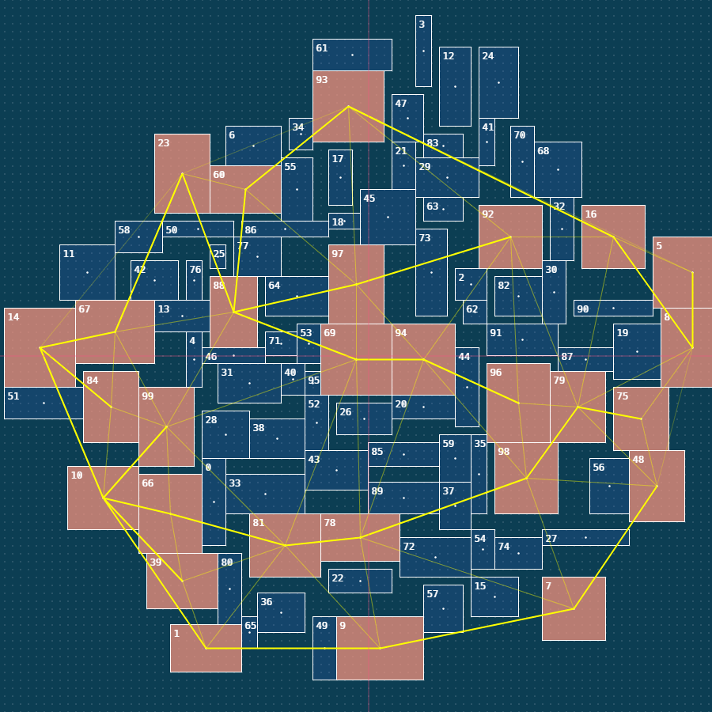

# Procedural Dungeon Generation Algorithm in JS

Based in the Gamsustra article: [Procedural Dungeon Generation Algorithm](http://www.gamasutra.com/blogs/AAdonaac/20150903/252889/Procedural_Dungeon_Generation_Algorithm.php), based also on a post from the [TinyKeep](http://store.steampowered.com/app/278620/TinyKeep/) developers ( [original post](https://www.reddit.com/r/gamedev/comments/1dlwc4/procedural_dungeon_generation_algorithm_explained/) )

All the bad practices / bugs / and missconceptions are by myself, sorry in advance ;)

**DISCLAIMER:** This is a **WIP** project, some parts may be buggy, use with caution.



# Requirements / third party tools and libs used

For the drawing I use a tiny JS library of myself called [Canvaz](https://github.com/carloscabo/canvaz). Its a HTML5 Canvas wrapper with some tools.

[Fast Delauny Triangulation](https://github.com/ironwallaby/delaunay) by [ironwallaby](https://github.com/ironwallaby).

[Implementation of Kruskal's algorithm to find the minimum spanning tree of a graph](https://github.com/abetusk/kruskal.js) by [abetusk](https://github.com/abetusk).

# How to use

Start a webserver of tour choice in the root folder and watch the magic.

```
php -S 127.0.0.1:1234
```

More info and samples coming soon.
